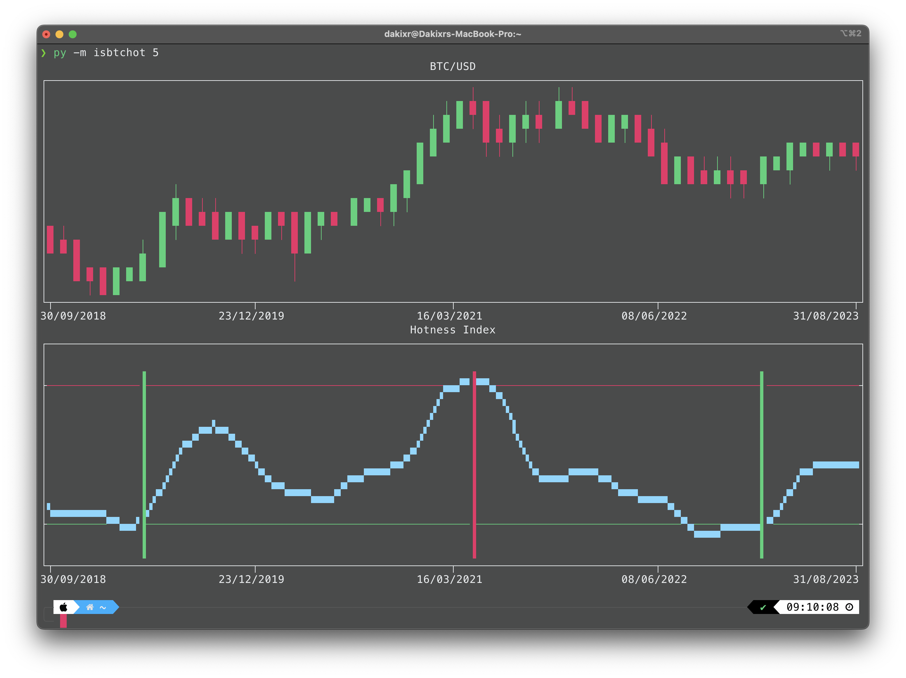
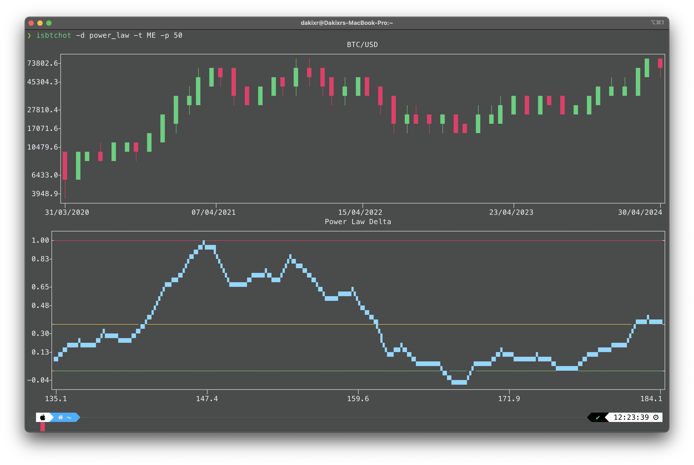

# isbtchot: BTC Hotness Index Dashboard

The `isbtchot` package provides a minimalist terminal dashboard for visualizing Bitcoin's (BTC) hotness index. It utilizes historical BTC data to generate visualizations of BTC's price alongside the Hotness Index, directly in your terminal.

## Features:

- Visualizes BTC candlestick plots with log scale options.
- Displays the Hotness Index based on proprietary indicators with buy/sell signals.
- Supports different time frames and custom period back settings to tailor the data.
- Offers multiple dashboard views including standard hotness index and power-law delta.
- Data is cached locally to expedite subsequent visualizations.

## Installation

```bash
pip install isbtchot
```

## Usage

You can run the main dashboard with flexible command-line options:

```bash
isbtchot [--periods_back P] [--time T] [--dashboard D]
```

- `--periods_back`, `-p`: Specifies the number of periods back to process for generating the visualization. Defaults to 85.
- `--time`, `-t`: Specifies the candlestick time frame (e.g., Weekly, Monthly). Defaults to Weekly.
- `--dashboard`, `-d`: Choose the type of dashboard to display: `isbtchot` for the standard hotness index or `power_law` for the power-law distribution analysis. Defaults to `isbtchot`.

### Command Line Arguments

| Argument       | Short Form | Description                                                                     | Default   |
|----------------|------------|---------------------------------------------------------------------------------|-----------|
| `--periods_back` | `-p`       | Number of periods to be processed for the data visualization.                    | 85        |
| `--time`        | `-t`       | Candlestick time to use (e.g., ME for Monthly, W for Weekly).                   | W         |
| `--dashboard`   | `-d`       | Dashboard type to display: `isbtchot` or `power_law`.                           | isbtchot  |

## Demo

### Hotness Index Dashboard
Historically very reliable for bull market tops:


### Power Law Delta Dashboard
Historically very reliable for bear market bottoms:


## Notes

- For optimal visualization, maximize your terminal window.
- Data is fetched from CryptoCompare API and cached to enhance performance and responsiveness.

## Contributions

Contributions are welcome! Please feel free to submit issues, enhancements, or pull requests. If you encounter a bug or have a feature suggestion, please open an issue on GitHub.